# Computer Vision Course - Project #1

---
# Table of Content

| Requiered Part | Title |
| ----------- | ----------- |
| [#Part 0](#part-0) | Graphical User Interface - GUI |
| [#Part 1](#part-1) | Add additive noise to the image |
| [#Part 2](#part-2) | Filter the noisy image |
| [#Part 3](#part-3) | Detect edges in the image |
| [#Part 4](#part-4) | Draw histogram and distribution curve |
| [#Part 5](#part-5) | Equalize the image |
| [#Part 6](#part-6) | Normalize the image |
| [#Part 7](#part-7) | Local and global thresholding |
| [#Part 8](#part-8) | Transformation from color image to gray scale |
| [#Part 9](#part-9) | Frequency domain filters |
| [#Part 10](#part-10) | Hybrid images |

---

# Part 0

## Graphical User Interface - GUI

We display all the requirments in one window
using the GUI you can change some parameters like:

    1. type of the filter
    2. noise value
    3. threshold 

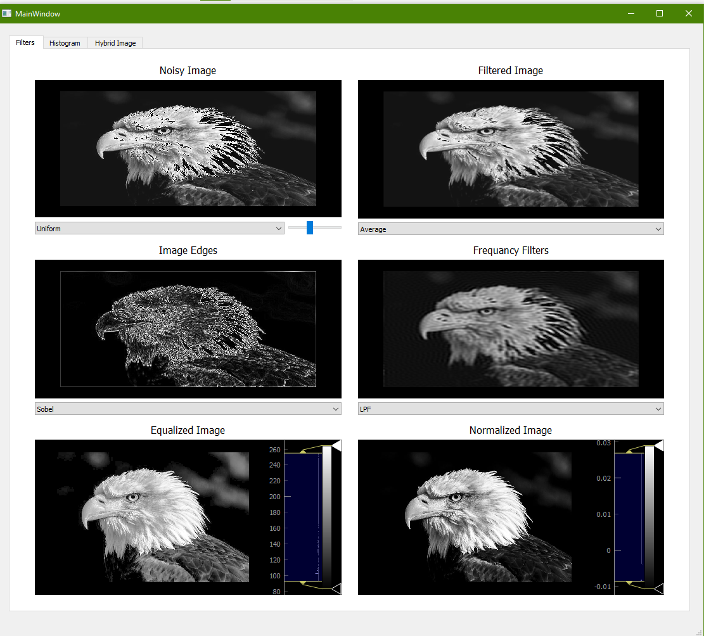

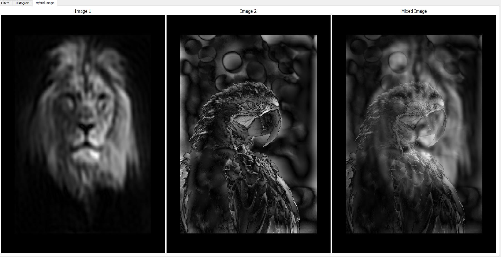

---

# Part 1

## Add additive noise to the image

We add three different type of noise :

* Uniform
* Guassian
* Salt & Pepper

You can change between them using combo box and change the amount of noise using slider

### Uniform

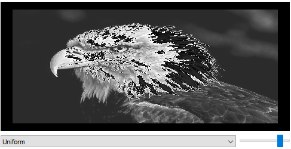

### Guassian

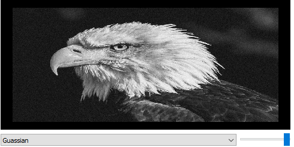

### Salt & Pepper

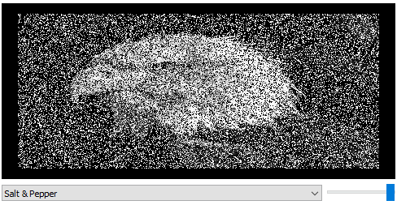
---

# Part 2

## Filter the noisy image using the following low pass filters

in this section we use function "avgFilter" to manipulate the noisy image with a specific filter we choose and the result is ...

## - original image

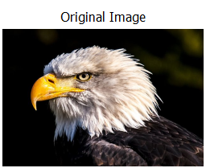

## - Average filter

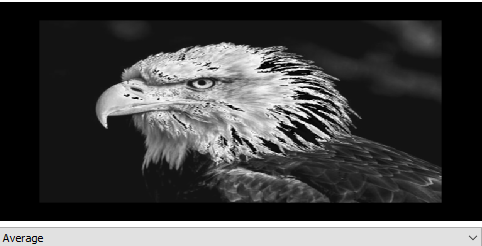

## - Gaussian filter

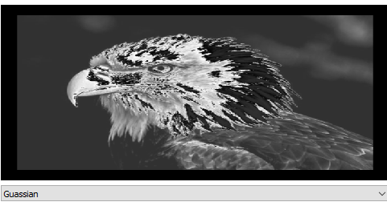

## - median filters

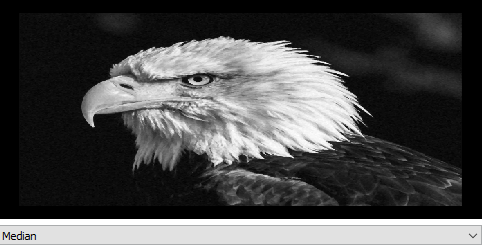

---

# Part 3

## Detect edges in the image using the following masks

## - Sobel , Roberts , Prewitt and Canny edge detectors

in this section we use function "edgFilters" to manipulate the image with a specific filter we choose and the result is ...

## - original pic

## - Sobel filter

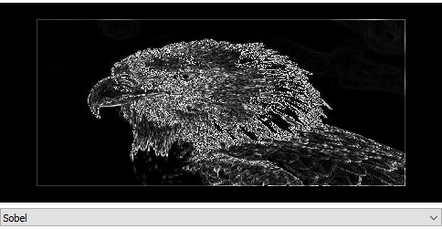

## - Roberts pic

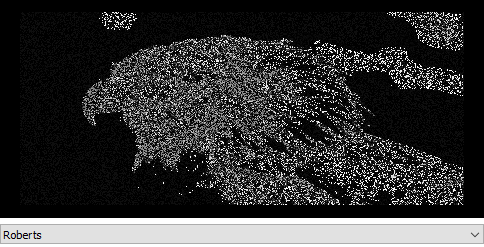

## - Prewitt filters

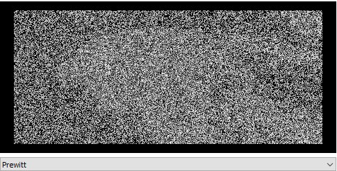

---

# Part 4

## Draw histogram and distribution curve

In this part we've implemented a function called "df" that takes an image data array and return the histogram values for each intensity value.

Using that values to draw a "BarGraphItem" on pyqtgraph we got the following output...

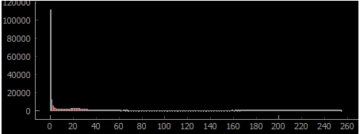

---

# Part 5

## Equalize the image

Using the previous histogram to generate a histogram equalization function by looping over the whole image array and equalize the output of the process we got the following image...

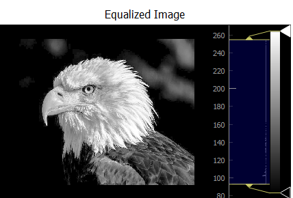

You can see the difference in histograms, now it's values distributed over larger range of data.

---

# Part 6

## Normalize the image

Normalization process doesn't depend on histogram, as we know.

By calculating the mean and standard deviation for image data array and using the following equation:

`New Value = (Original Value - mean) / std^2`

We got the following image...

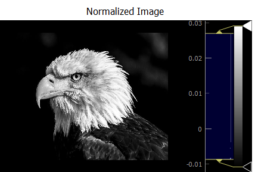

---

# Part 7

## Local and global thresholding

Global Thresholding: We implemented the global function where it iterates over all the image's pixels and assign it to a new value where it becomes 255 or 0 according to whether or not it's greater than a given threshold provided by the user.

Local Thresholding: We implemented the local function to work as it divides the image to many smaller windows where their size is selected by the user, the mean is calculated to the selected window and then is used as the threshold value to this window by applying the same technique used in the global function, the user have the option to choose if a constant is needed to be subtracted from the mean before applying it to the window.

---

# Part 8

## Transformation from color image to gray scale image and plot of R, G, and B histograms with its distribution function (cumulative curve that you use it for mapping and histogram equalization)

The  transformation of a colored image to a gray scale image was done by selecting each corresponding pixel in the 3 channels(ie. RGB) and multiplying these value by certain constant values respectively and add them together. the result is then equal to the pixel value needed to acheive the suitabale grey color for that pixel.

Where its histogram is displayed as follows
<!--  -->

---

# Part 9

## Frequency domain filters (high pass and low pass)

in this section we use function "freqFilters" to manipulate the image with a LPS or HPS in the frequency domain and get the pic back and the result is ...

## - original pic

## - low pass filter

## - High Pass filter
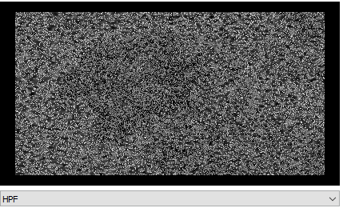

---

# Part 10

## Hybrid images

After implementing the high pass and the low pass filters required in part 9, hybrid images could be acheiving by simply applying the high filter on an image and the low pass on another and adding the results of each together to reach the merging between the two images needed.

---
